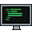
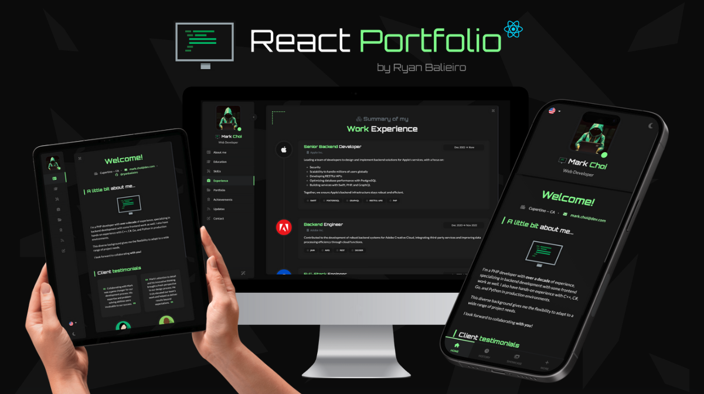
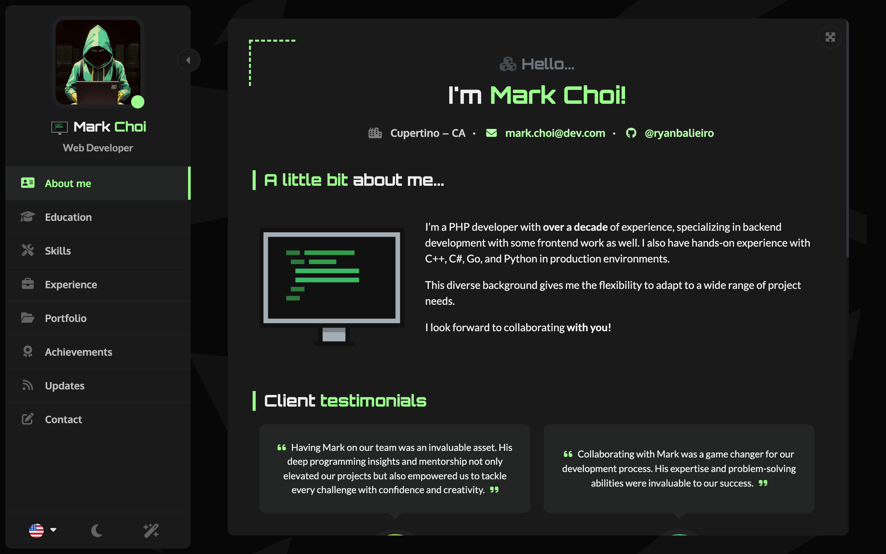
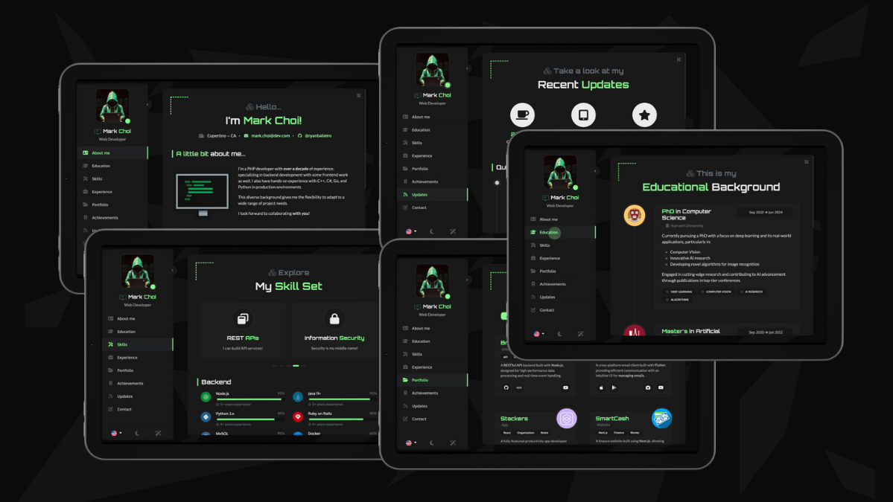
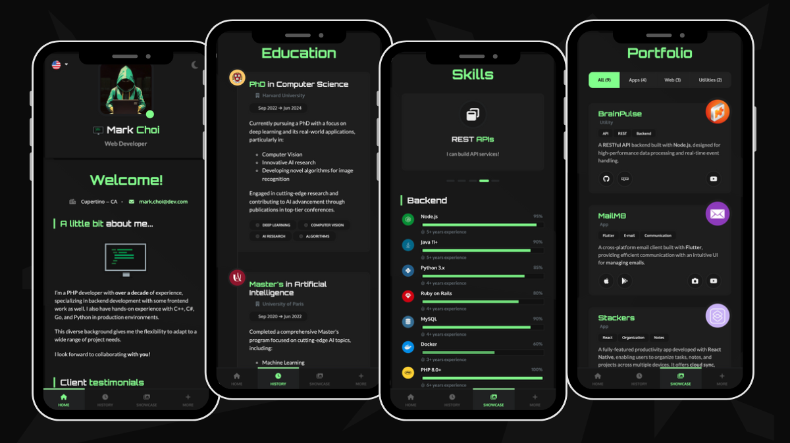

# [ React Portfolio](https://ryanbalieiro.github.io/react-portfolio-template/) by Ryan Balieiro

A sleek, futuristic portfolio template for developers – built with **React** and **Bootstrap 5**.



Key features:
- Lightweight and fully responsive.
- Adapts perfectly to mobile screens.
- Multi-language support included.
- Comes with both dark and light theme options.
- A variety of components to highlight your work experience, education, skills, portfolio, and more.
- Uses **Vite** for packaging.
- Emails with **EmailJS** - no backend needed!

## [Live Preview](https://ryanbalieiro.github.io/react-portfolio-template/)

Check out the live version of the template deployed **[here on GitHub Pages](https://ryanbalieiro.github.io/react-portfolio-template/)**.

### 1. Base layout
The layout uses a fixed central view with a left sidebar, adjusting perfectly across various monitor resolutions, from 4:3 to ultra-wide.



### 2. Desktop Screenshots
The main view transitions smoothly when a new page is selected from the sidebar, giving a page-flipping effect. The sidebar is also toggleable, allowing the content area to expand for a larger viewing space.



### 3. Mobile Screenshots
On mobile, the layout groups the portfolio sections into categories and transforms into a tabbed interface with a bottom navigation.



## Installation

1. Clone the repo:
```
git clone https://github.com/ryanbalieiro/react-portfolio-template
```

2. Go to the root directory of the project and install all dependencies with npm:
```
npm install
```

3. Run the project in developer mode:
```
npm run dev
```

4. To temporarily deactivate the preload animation during theme adjustments, go to `public/data/settings.json` and modify the following field:

```
"preloader": {
    "enabled": false,
    (...)
},
```

## Template Customization

### 1. Changing the content

All portfolio content, including text and images, is located in the `public` folder at the root level. Within this folder, you'll find two key directories:

- `public/data` ➔ Contains JSON files with the portfolio's texts and general configurations.
- `public/images`➔ Contains all the images used in the portfolio.

To customize the content of the portfolio, simply edit the JSON files and swap out the images as needed. It's that easy!

### 2. Customizing the colors

You can easily adjust the theme colors by editing the SCSS variables in `src/styles/_variables.scss`. This file contains the portfolio's static colors as well as the color palettes for both the light and dark themes. 

Simply modify these variables to customize the layout to your liking.

### 3. Adding and removing languages

To add or remove languages, open `public/data/settings.json` and modify the `supportedLanguages` field as needed. Use the `default` property to specify the fallback language that should be used if the application doesn't support the user's preferred language.

```json
{
    "supportedLanguages": [
        {
            "name": "English",
            "id": "en",
            "flagUrl": "images/flags/en.png",
            "default": true
        },

        {
            "name": "日本語",
            "id": "ja",
            "flagUrl": "images/flags/ja.png"
        }
    ]
}
```

The `public/images/flags/` folder already contains a collection of flags for commonly used languages. If you require a specific flag icon that isn't there, you can download it [here](https://www.flaticon.com/packs/countrys-flags) for free.

To **deactivate support** for multiple languages, keep only a single language within the array. This will automatically hide the language picker menu.

### 4. Adding, removing and reordering sections

Inside the `public/data/structure.json` file, you will find two arrays: one for **sections** and the other for **categories**. Every section **must** be linked to a corresponding category, which is essential for grouping sections in the mobile navigation.

Adding, removing or reordering the sections can be achieved by making modifications to the `sections` array:

```json
{
    "sections": [
        {
            "id": "about",
            "categoryId": "home",
            "jsonPath": "/data/sections/cover.json",
            "faIcon": "fa-solid fa-address-card"
        },
        
        {
            "id": "education",
            "categoryId": "background",
            "jsonPath": "/data/sections/education.json",
            "faIcon": "fa-solid fa-graduation-cap"
        }
    ]
}
```

Each section entry comprises the following fields:

- ***id*** ➔ A unique identifier for the section.
- ***categoryId*** ➔ Specifies the category to which the section belongs (used for grouping sections in the mobile navigation).
- ***jsonPath*** ➔ The file containing the section's content.
- ***faIcon*** ➔ The FontAwesome icon associated with the section.

### 5. Editing the section content

You can customize the content of a section by editing its corresponding JSON file.

Each section JSON file contains two main fields:
- `locales` ➔ Translations for the section's general information, such as the title.
- `articles` ➔ A list of components that render the section and its respective content.

You can add or remove articles from sections by editing the items of the `articles` array: 

```json
{
    "articles": [
        {
            "component": "ArticleTestimonials",
            "locales": {},
            "items": []
        },

        {
            "component": "ArticleInfoBlock",
            "locales": {},
            "items": []
        }
    ]
}
```

**Important note**: each type of article may require a different item structure, so refer to existing examples for guidance on how to structure the JSON object for each type of component.

### 6. Localizing texts

Place your translations for **static texts** in `public/data/strings.json`. This file serves as a central hub for all your global localization needs, making your translations accessible via the helper method `getString`:

```js
import {useLanguage} from "/src/providers/LanguageProvider.jsx"
const {getString} = useLanguage()

const translation = getString("close")
console.log(translation) // Will print "Close" (en) or "Cerrar" (es)
```

For translations specific to sections, you can create a custom `locales` field inside the section's JSON file: 

```json
{
    "locales": {
        "en": {
            "hello": "Hello!",
            "age": "Age"
        },
        
        "es": {
            "hello": "Hola!",
            "age": "Edad"
        }
    }
}
```

And then, use the following helper function to fetch the translation for the user's preferred language:

```js
import {useLanguage} from "/src/providers/LanguageProvider.jsx"
const {getTranslation} = useLanguage()

const hello = getTranslation(section.content.locales, "hello")
console.log(hello) // Will print "Hello!" (en) or "Hola!" (es)
```

### 7. Contact form configuration

The contact form component integrates `EmailJS`. EmailJS is a free service that allows you to send emails using JavaScript - without the need for a backend.

To configure your contact form, follow these steps:

- Create an EmailJS account (https://www.emailjs.com/)
- In your EmailJS account panel, create an email service, which configures the provider that will send the emails (e.g., your Gmail or iCloud account).
- Next, on your dashboard, create a new email template like this one:

```
You got a new message from {{from_name}} ({{from_email}}):

Subject: {{custom_subject}}

{{message}}
```

- Now, open `settings.json` in your project and fill in the `emailjs` dictionary with your account info:
```json
{
    "emailjs": {
        "publicKey": "YOUR_EMAIL_JS_PUBLIC_KEY",
        "serviceId": "YOUR_EMAIL_JS_SERVICE_ID",
        "templateId": "YOUR_EMAIL_JS_TEMPLATE_ID"
    }
}
```

- Finally, submit your first email! The message will be delivered to both the inbox of the email you used to create your EmailJS account and the "Email History" section in the EmailJS dashboard.

## Deployment

Open `vite.config.js` and set the base directory for your application. This setting defines the main path that your website will be hosted under.

```js
export default defineConfig({
  base: '/react-portfolio-template/',
  plugins: [react()],
})
```

In simple terms, if you consider GitHub hosting the GitHub Pages site for this repo at the URL `https://ryanbalieiro.github.io/react-portfolio-template/`, the correct base directory to set is `/react-portfolio-template/`.

If you're deploying to Netlify or your own custom domain where your website is located at the root, you can leave the `base` setting as `'/'`.

To compile your project for production, execute:

```
npm run build
``` 

This command triggers a series of processes that package your code, assets, and other necessary files, ultimately creating a production-ready version of your project. After running the command, you'll find the compiled files within the `dist` folder. 

## About

This template was created by and is maintained by **[Ryan Balieiro](https://ryanbalieiro.com/)**.

It's based on the **[React](https://reactjs.org/)** framework created by Jordan Walke, and the **[Bootstrap](https://getbootstrap.com/)** framework created by Mark Otto and Jacob Thorton.

Additional frameworks and plugins used include:
- **Font Awesome**: A library of free vector icons.
- **Smooth Scrollbar**: A customizable scrollbar plugin.
- **Swiper**: A powerful library for creating touch sliders.
- **EmailJS**: A free service that allows you to send emails using JavaScript.

## Copyright and License

Code released under the [MIT](https://github.com/StartBootstrap/startbootstrap-agency/blob/master/LICENSE) license, providing complete freedom for utilization. Feel free to enhance and adapt it to suit your needs.

Oh... and if you like this template, don't forget to **give it a ⭐** :)